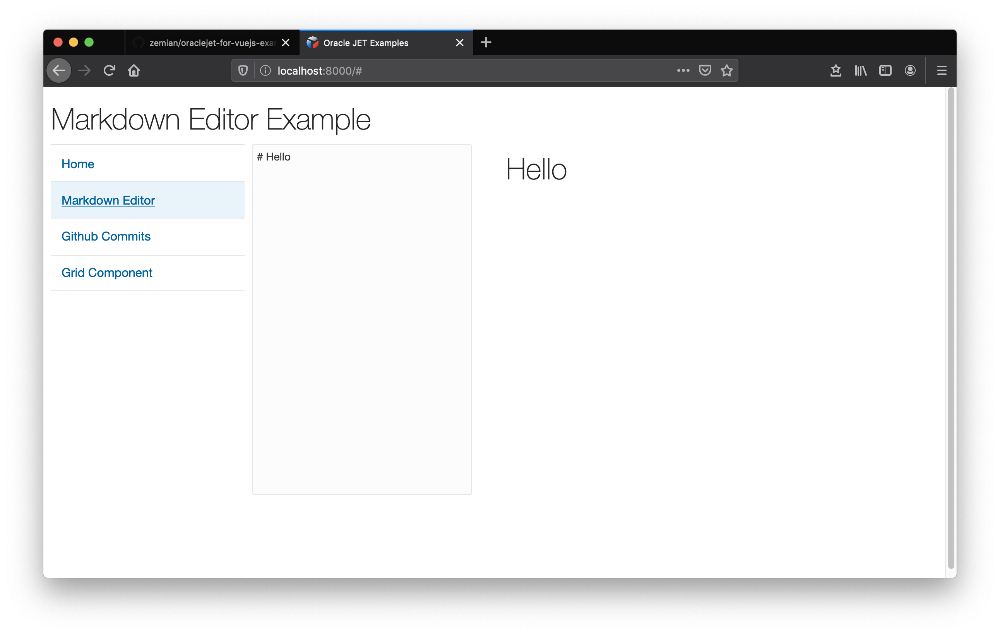
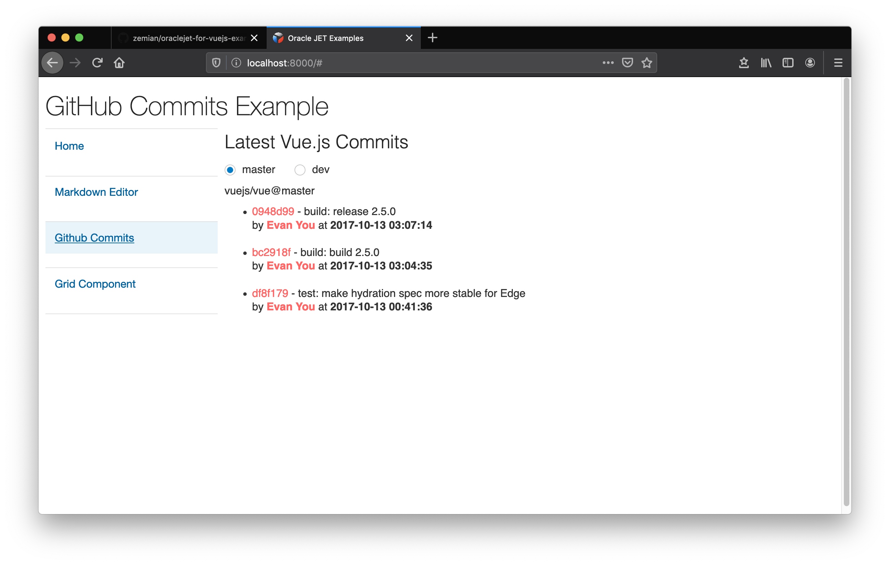
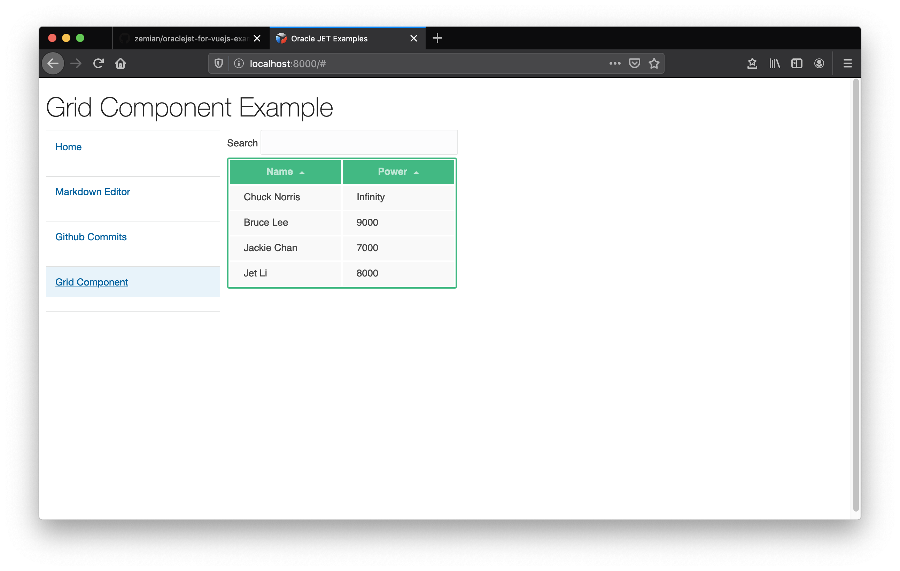

Here is a Oracle JET project that re-implements some of the 
VueJS Examples from https://vuejs.org/v2/examples/.

To get started:

```
npm install
npx ojet serve
# open http://localhost:8080
```

In each example, there are some developer notes and tips in
comparing the two framework usage. To see more details, open each
file under `src/js/examples` folder.

## Some Oracle JET Example Screenshots





## Fixing Example CSS files

The example css files assume each example is it's only example and style some 
elements globally. This affected some of OJET own theme styling. So a fix 
is added to prefix some elements with #demo container selector to prevent this
problem.

## VueJS Examples

A copy of the VueJS (v2) Examples under `vuejs-examples` 
directory. These examples should able to run by opening the `index.html` 
in a browser without running a web server. 

Examples List:

* Markdown Editor
* GitHub Commits
* Grid Component
* Tree View
* SVG Graph
* Modal Component
* Elastic Header
* Wrapper Component
* Realtime with deepstreamHub
* Firebase + Validation
* TodoMVC
* HackerNews Clone
