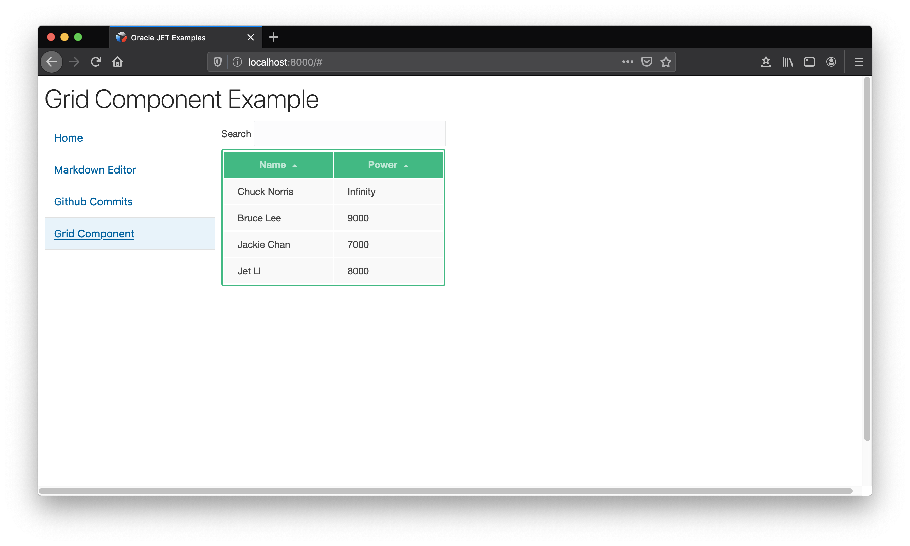

Here is a Oracle JET project that re-implements some of the 
VueJS Examples from https://vuejs.org/v2/examples/.

To get started:

```
npm install
npx ojet serve
# open http://localhost:8080
```

In each example, there are some developer notes and tips in
comparing the two framework usage. To see more details, open each
file under `src/js/examples` folder.

## Some Oracle JET Example Screenshots




## Fixing Example CSS files

The original example css files assume each example is in it's own html page
and style some elements globally. This affected some of OJET own theme styling
when we try to load all examples as single page application. So a fix is added 
some example css to prefix some elements with #demo container selector. This 
prevents style overrides problem. Other than this, the example should look
and behave the same as original work.

## Examples List

A copy of the original VueJS (v2) Examples is under `vuejs-examples` 
directory. These examples should able to run by opening the `index.html` 
in a browser without running a web server. 

Re-implementation List:

- [x] Markdown Editor
- [x] GitHub Commits
- [x] Grid Component
- [x] Tree View
- [x] SVG Graph
- [ ] Modal Component
- [ ] Elastic Header
- [ ] Wrapper Component
- [ ] Realtime with deepstreamHub
- [ ] Firebase + Validation
- [ ] TodoMVC
- [ ] HackerNews Clone
